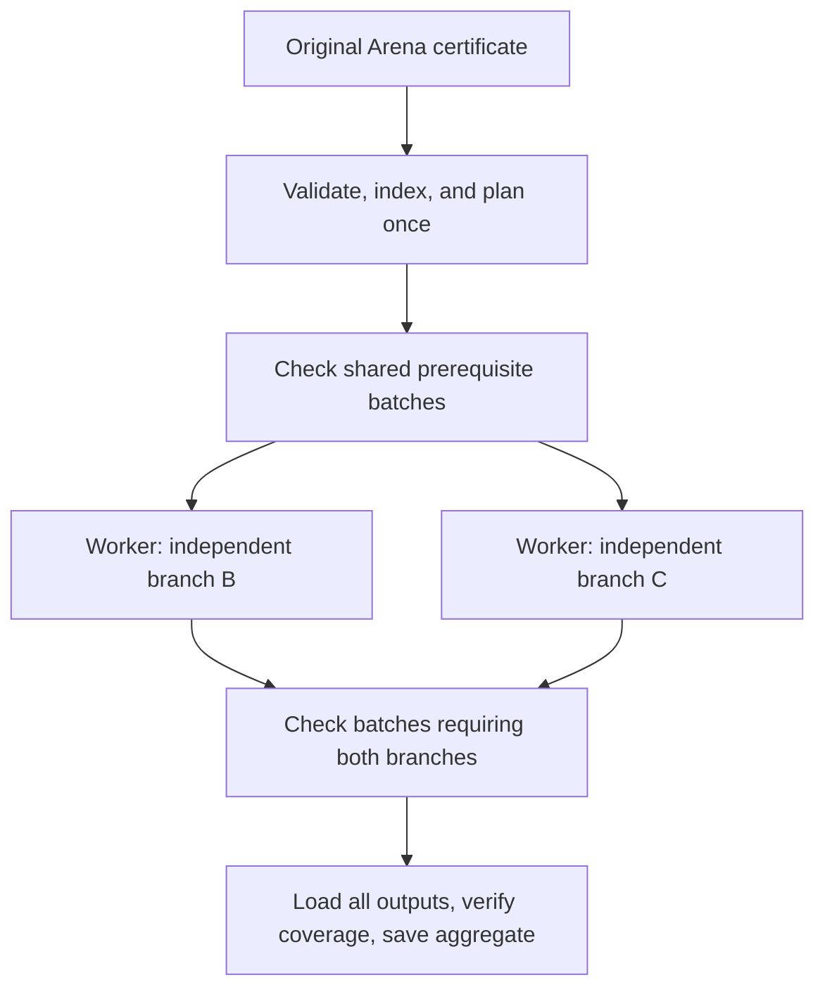

# Parallel checking of complete Arena certificates

Design, 2026-09-09. This proposes an importer architecture and implementation
sequence; the executable accompanying it is an **offline scheduling model**,
not a parallel proof checker.

Implementation update: the first local batch checker and its integration
evidence are in [this report](../work/distributed-import-implementation-20260909/README.md).
Full CSLib acceptance and speedup are still unverified.

The target is the unchanged Arena input: **253,649 importer entries,
262,983 named constants, and 21,039,124 expression nodes** for the pinned CSLib
certificate. Every original entry remains an obligation, including declarations
from imported libraries. The smaller 26,088-entry selected export is outside
this design. Input hash and measurement provenance are in the
[original analysis](../work/cslib-module-overlap-20260909/README.md).

## Decision

Use a dependency graph of declaration families, batch its independent work,
and compile batches in isolated Rocq processes. Each batch produces an ordinary
kernel-checked `.vo` and a small, additive importer registry. Other batches
require those artifacts. The shared dependencies are checked by their owners
once during a successful run; loading them in several workers still costs time
and memory.

Start with two workers on this machine, then measure four. The i7-1165G7 has
four physical cores and eight logical processors, with 32 GiB RAM. Worker count
must also fit one aggregate memory budget. A prior full import reached about
10.59 GiB RSS, so four copies of the full environment are not a viable default.



The real graph has many shared prerequisites. It should also distribute work
inside Init, Std, Batteries, and Mathlib; putting those libraries into one huge
serial base would leave most of the current certificate sequential.

## 1. Build the graph from the certificate

Arena supplies an NDJSON certificate through `$IN`, not the original Lean
project. Production scheduling therefore cannot depend on Lean, `.olean`
metadata, module filenames, or a different exporter invocation. Keep the
[existing Arena contract](../_deps/lean-kernel-arena/README.md).

The front end validates the complete input and writes a versioned, immutable
index of names, universes, expressions, declaration records, and original
locations. Preserve numeric IDs and name component types: generated Lean names
do not all round-trip through a printable name parser. A flat index can be
memory-mapped by workers; OCaml term heaps cannot simply be shared that way.

For each declaration family, collect dependencies from its type and body,
including theorem and opaque proof bodies. Also account for projections,
constructors, recursor rules, quotient primitives, and the translator's implicit
literal/helper dependencies. The parser must retain binder information,
universe parameters, genuine opacity, and reduction hints. Splitting the text
by line number is insufficient because its nodes refer to shared global IDs.

Use iterative expression traversal with a generation-stamped visited array and
a bounded cache of dependency summaries. Avoid storing an unbounded set of all
reachable constants at every expression node. Measure this phase separately;
the full input contains 21 million expression nodes, and indexing is initially
serial. Workers then read only their required slices of the immutable index.

An indivisible atom is a supported declaration family: in particular a mutual
inductive family, its constructors, and associated generated recursors must
remain coherent. Ordinary references require an already checked provider.
Arbitrary declaration cycles are an error, not permission to assume the
statements and check them mutually. The offline model condenses strongly
connected components for structural analysis only; production must recognize
the legal constructs explicitly.

## 2. Own generated instances as well as source declarations

Source dependencies alone do not describe the current importer. In
[`ensure_exists`](../_worktrees/rocq-lean-import/compact-peano-importer-current/src/lean.ml#L3372),
a reference can recursively create a previously unseen universe specialization.
Constructors delegate to their inductive owner, and mutual families have a
shared instantiation path.

Use this logical ownership key:

```text
(input hash, source family ID, SProp specialization mask,
 representation/helper role, translation ABI)
```

Every source entry keeps its default mask-zero obligation, as in the current
non-lazy import. Other masks are demanded as needed. The reported count of
"possible instances" is a theoretical count, not a list of instances actually
checked; eagerly creating every mask would add unnecessary work.

In the distributed path, a missing instance becomes a structured
`NeedInstance(key)` request. The coordinator assigns one producer, adds the
dependency, and blocks the consumer until the producer's checked artifact is
committed. It must not allow every consumer to independently declare that
instance. Newly demanded instances get new immutable provider artifacts.

Discover these requests before expensive kernel checking where possible.
A request discovered later can require restarting an uncommitted batch. Record
that repeated work explicitly. If a newly discovered dependency creates a
cycle only because of batching, split or replan the uncommitted batches;
published ownership and artifact names remain fixed. Unsupported semantic
cycles fail. A genuine checking failure is never retried under different
orders until one happens to pass.

The invariant is **one committed checked provider per key**, with no planned
rechecking of dependency bodies. Interrupted attempts and replanning can repeat
discarded work; the scheduler cannot promise that physical work never repeats.

## 3. Make importer state composable

This is the principal prerequisite for useful parallelism. Current checkpoint
loading replaces the importer state: see
[`cache_lean_state`](../_worktrees/rocq-lean-import/compact-peano-importer-current/src/lean.ml#L4916)
and the packed library object. Two sibling checkpoints cannot be combined by
loading their whole snapshots successively.

Separate the state into three parts:

| State | Ownership and lifetime |
|---|---|
| Parsed input catalog | Immutable, shared index for the run |
| Checked registry | Additive records supplied by checked prerequisite artifacts |
| Translation/reduction caches | Worker-local, disposable |

Each registry delta exports the keys owned by its batch and their qualified
Rocq references, algebraic universe mappings, family ownership, relevance and
squash encoding information, projection aliases, helper registrations, and
required reduction metadata. It binds its prerequisite artifact hashes.
Identical records for the same provider may be deduplicated; conflicting
ownership or metadata fails. Loading independent branches in either order
must produce an equivalent checked registry.

Two further sources of order dependence need explicit treatment:

* [`name_for`](../_worktrees/rocq-lean-import/compact-peano-importer-current/src/lean.ml#L1041)
  currently chooses a fresh name from the existing global environment. Assign
  deterministic names within a fixed provider namespace before emitting terms.
  Record the key-to-provider mapping in the plan; once published, it cannot move.
* String translation currently chooses `String.mk` or `String.ofList` partly
  from membership in the mutable `entries` map. Preloading the whole catalog
  or changing worker history must not silently change that policy. Freeze
  representation choices in the plan, separate catalog availability from
  checked availability, and validate the new planner serially first.

The global `Set+n` surrogate universe ladder also needs one canonical provider.
The planner must derive its required bound using the importer's normalization
rules, or turn any additional demand into an explicit provider dependency.
Workers must not invent conflicting global levels independently. Other scheme,
record, unit, and primitive-helper registrations need the same ownership audit.

Independent batches can add constraints that become inconsistent only when
combined. A successful final join must validate the union of universe
constraints and registry records. Individual worker success is insufficient.

## 4. Batch and schedule the work

Use small batches of independent families as the first implementation.
Grouping families at the same dependency depth guarantees acyclic batching;
retain their exact prerequisite edges and do **not** impose barriers between
whole depth layers. Prefer grouping families with similar prerequisite contexts
to reduce repeated environment loading.

Do not make one `.vo` per declaration, and do not treat a Lean file as an
automatically valid batch. Merging nonadjacent graph nodes can create a cycle:
`A1 -> B -> A2` becomes `A -> B -> A` if A1 and A2 share an artifact. Every
coarsening must be checked. The full-CSLib structural model actually encounters
cycles when grouping by recorded source-file ownership; its cycle-merged file
policy is only a comparison, not the selected production policy.

Initial size experiments use 32, 128, and 512 entry units. These are model
parameters, not recommended production batch sizes. After instrumentation,
choose batches using estimated checking time, dependency-load cost, and peak
memory. As a starting tuning rule, aim for useful checking work at least ten
times the measured worker start/load/save overhead, while preserving several
ready batches per worker. Split oversized batches only between legal families.

Prioritize ready batches by their estimated longest remaining dependent path.
Break ties by context locality and stable source order. Admit work only when
its reservation fits both the worker count and aggregate memory budget; backfill
with smaller ready tasks if necessary. Add aging to avoid starving large tasks.
Use measured task times to improve estimates, not just declaration counts.

Start with a fresh Rocq process per batch for a clear state boundary. Persistent
workers or forked prerequisite environments are later experiments: they need
a proven reset of all global/library/plugin state, and garbage collection can
erode copy-on-write sharing. They are not required for the initial architecture.

## 5. Worker protocol and completion

The manifest binds the input SHA-256, parser and registry schemas, planner and
representation versions, build hashes/options for Rocq, the importer, and the
foundation, plus exact ownership of all original entries. A source revision
alone is insufficient when local source or build products differ.

```text
Task: plan epoch, batch ID, attempt token, owned keys, input-index identity,
      prerequisite artifact hashes, memory reservation, deadline

Result: attempt token, checked .vo, registry delta, completed-key ledger,
        prerequisite hashes, phase timings, peak RSS, original source locations

States: waiting dependencies -> ready -> running -> staged -> committed
        running -> waiting dependencies on a new instance request
        any checking/operational failure -> failed; cancel dependent work
```

Only a successful normal compiler exit and complete staged output permit atomic
publication. Ignore stale attempt results, reject hash/ownership conflicts, and
never publish truncated artifacts. Artifact hashes establish identity; they do
not establish that a proof is valid. That check is the Rocq compilation itself.

After all batches complete, compile an aggregate file requiring **every batch**.
Verify exact original-entry coverage, all demanded instances, registry agreement,
and the combined universe context. Save the aggregate successfully and reap all
workers before reporting success. Release unnecessary index/caches before this
join so its full environment fits the same memory budget.

Normal `.vo` loading uses artifacts checked by producers in this run; it does
not independently recheck every proof body. A separate independent artifact
checker can be a validation gate, but including that second proof pass inside
a benchmark must be charged consistently. Printing `Done!` is not completion:
our existing [full-pass audit](../scripts/audit_rocq_full_pass.py) also requires
successful exit and the actual saved artifact.

Retain Arena's result meanings: 0 accepted, 1 invalid, 2 declined/unsupported,
other statuses operational failure. Timeout, memory exhaustion, worker crash,
or incomplete coverage must never become success or a claim of invalidity.
The global deadline includes indexing, queues, checking, loading, and finalization.

## 6. Resource control and benchmark boundaries

The current [memory guard](../work/run-memory-guarded.sh#L440) explicitly stops
the workload if it observes more than one Rocq worker. Parallel execution
therefore needs an intentional guard extension: a bounded worker-count option,
defaulting to one, inside the existing single managed workload. Preserve the
aggregate RSS/cgroup limits, available-memory reserve, swap policy, detection
of unexpected external workers, and cleanup of the entire process pool.
Do not give each worker the full current 16 GiB allowance.

The runner also needs coordinator-aware process tracking and watchdogs. Separate
queued, dependency-blocked, and actively checking time; one busy worker must
not hide another stalled task. Cancellation must terminate all descendants and
discard unpublished results. No guard or running experiment was changed for
this design.

A cold Arena run includes certificate conversion/indexing, planning, every
required batch check, artifact loading/writing, scheduling overhead, and the
final join. Shared `.vo` files are produced during that run. Do not substitute
prechecked target-library artifacts from an earlier run. Keep the installed
checker/foundation build boundary consistent with the sequential baseline.
Warm-cache or resumed experiments can be reported separately.

## 7. Evidence and expected gain

The accompanying [model and results](../work/distributed-import-design-20260909/README.md)
use the previously collected full-certificate Lean dependency metadata to
compare schedules. That metadata is an offline design dataset, not a runtime
requirement. All original entries are retained. Structural results and their
limitations are recorded there.

For example, batching independent families into approximately 128-entry groups
gives 2,071 tasks and a four-worker graph-only speedup of 3.80–3.90x across the
two proxies. Consecutive 256-entry topological chunks give only 1.49–1.59x.
This supports dependency-aware batching; it does not establish a production
batch size or measured gain.

The model measures neither Rocq checking time nor RSS. Entry counts and
first-introduced expression-node counts are two deliberately crude work
proxies. It omits on-demand translation instances, process startup, repeated
loading, serialization, finalization, and kernel conversion imbalance. Near-linear
speedup in this model demonstrates graph width, not a benchmark prediction.

For measured task costs, a useful lower bound is:

```text
T_parallel >= T_index + max(total checking work / workers, critical-path work)
             + unavoidable loading/finalization overhead
```

Memory limits and scheduling imbalance can make the actual time much larger.
For illustration only, Amdahl's law gives the following four-worker ceilings
before new overhead: 3.08x with 10% serial work, 2.29x with 25%, and 1.60x with
50%. These fractions have not been measured here.
[Amdahl's law](https://cvw.cac.cornell.edu/parallel/efficiency/amdahls-law)
explains the limitation.

**Keep 2–3x as a provisional target on this laptop, not a promised result.**
A single expensive conversion can dominate a whole batch and the dependency
path after it. Parallel scheduling cannot divide that individual kernel check;
the delta-unfolding work remains a separate optimization. End-to-end speedup
must be measured against a successful sequential run that saves its artifact.

Rocq's existing asynchronous proof machinery does not provide this architecture
automatically. It principally schedules opaque proof tasks, whereas `Lean Import`
is one side-effecting command whose translator synchronously declares entries.
Many imported theorems retain transparency with reduction hints. Preserve those
semantics and use ordinary checked `.vo` output, rather than skipping proof
checking through `.vos` or changing opacity to expose parallel tasks.
See the [parallel proof documentation](https://rocq-prover.org/doc/V9.2.0/refman/addendum/parallel-proof-processing.html)
and [compiled-library documentation](https://rocq-prover.org/doc/V9.2.0/refman/practical-tools/coq-commands.html).

## 8. Implementation sequence and acceptance gates

| Stage | Concrete change | Required evidence before advancing |
|---|---|---|
| 1. Timings | Machine-readable per-entry/instance parse, translation, kernel, load, and save timings; RSS and allocation summaries | Original sequential behavior preserved; costs attributed to original ID and mask; no large retained term traces |
| 2. Certificate plan | Immutable index, exact family graph, coverage manifest, deterministic representation policy | Planned one-worker run matches baseline coverage and accepted/rejected fixtures; malformed IDs, generated/private names, mutual families, literals, opacity, and current regressions covered |
| 3. Composable state | Owned specialization keys, additive registry, stable names/universes, checked batch artifacts | Diamond join works in both load orders; shared specialization has one provider; conflicting records and inconsistent universe joins fail |
| 4. Serial batches | Run the complete batch plan with one worker and final aggregate | Same input and checking semantics; complete saved artifact; measured batching overhead and final-join RSS |
| 5. Two workers | Coordinator, atomic publication, bounded pool support in guard/runner | Same cold workload succeeds; crash, cancellation, missing result, truncated artifact, stale attempt, and wrong-hash cases cannot pass or leave workers behind |
| 6. Tune | Time/RSS-based batching, locality, four-worker comparison | Report wall time, total CPU, peak aggregate memory, load/save time, idle/blocked time, retry work, and full coverage against one-worker baseline |

The most important first implementation is **composable state and a checked
diamond join**, supported by timing and graph instrumentation. A scheduler on
top of today's replacing checkpoints cannot deliver the intended reuse.

Multiple machines come later, if local measurements justify them. The same
artifact protocol can transfer checked prerequisites to identical toolchains,
but network transfer, artifact trust, and larger aggregate resource budgets
need separate measurement. A remote worker's Boolean success message alone
is never a replacement for the checked artifacts and completion audit.
